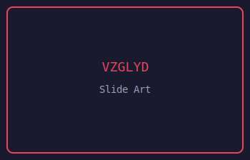

# lume-news

Aggregated news headlines from RSS, Reddit, and HackerNews.

## Preview



## Usage

Build the slide:

```bash
./build.sh
```

Produces `news.vzglyd` — a packaged slide ready to be placed in your VZGLYD slides directory.

## Sidecar

This slide consumes data from [`lume-news-sidecar`](https://github.com/lume-industries/lume-news-sidecar).
The sidecar fetches data, parses it, and delivers JSON payloads via the VZGLYD sidecar channel ABI.
Multiple visual slide designs can share this same sidecar.

## Requirements

- Rust stable with `wasm32-wasip1` target: `rustup target add wasm32-wasip1`

## License

Licensed under either of [MIT](LICENSE-MIT) or [Apache-2.0](LICENSE-APACHE) at your option.
